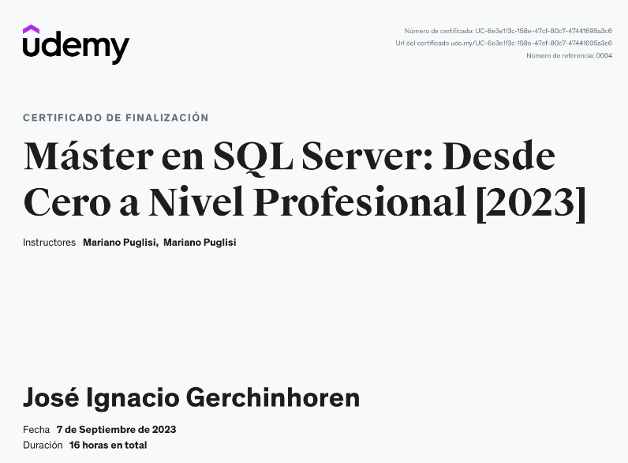

# Máster en SQL Server: Desde Cero a Nivel Profesional [2023]

Bienvenido al repositorio del curso "Máster en SQL Server: Desde Cero a Nivel Profesional [2023]" que completé en Udemy. En este repositorio, encontrarás las Querys SQL que realicé durante el curso, organizadas por secciones y temas, para ayudarte a repasar y practicar lo aprendido.

## Descripción del Curso

Este curso me proporcionó una comprensión profunda de SQL Server, desde los conceptos básicos hasta habilidades avanzadas. Aprendí cómo diseñar y administrar bases de datos, escribir consultas SQL efectivas y optimizar el rendimiento de las consultas, tambien aprendí a realizar funciones, stored procedures, vistas, backups y mas.

## Estructura del Repositorio

El repositorio está organizado de la siguiente manera:

-1. QuerysCreacionTablas
-2. QuerysSELECT-INSERT
-N. Querys corresponientes a la seccion.

Dentro de cada carpeta de sección, las consultas etiquetadas para facilitar la navegación y el aprendizaje.

## Instrucciones de Uso

Puedes explorar las carpetas de sección para acceder a las consultas SQL relacionadas con cada tema. Si deseas practicar o revisar un tema específico, simplemente navega hasta la carpeta correspondiente y abre los archivos de consulta SQL.

## Recursos Adicionales

Además de las consultas SQL, aquí encontrarás otros recursos útiles:

- **/Recursos**: Esta carpeta contiene documentos, notas o cualquier otro material adicional relacionado con el curso.

## Contribuciones

Si encuentras algún error en las consultas o tienes sugerencias para mejorar este repositorio, ¡te animo a contribuir! Puedes abrir problemas (issues) o enviar solicitudes de extracción (pull requests) para proponer cambios.

## Certificado de finalización

---

Link a certificado de finalizacion:
https://www.udemy.com/certificate/UC-6e3e1f3c-158e-47cf-80c7-47441695a3c6/?utm_source=sendgrid.com&utm_medium=email&utm_campaign=email

## Agradecimientos

Quiero agradecer a Mariano Puglisi por impartir este excelente curso en Udemy y por brindarme la oportunidad de aprender SQL Server de manera tan completa.

---

¡Gracias por visitar este repositorio! Espero que estas consultas y recursos te sean útiles en tu aprendizaje de SQL Server. Si tienes alguna pregunta o comentario, no dudes en contactarme.

Link al curso:
https://www.udemy.com/course/master-sql-server/

